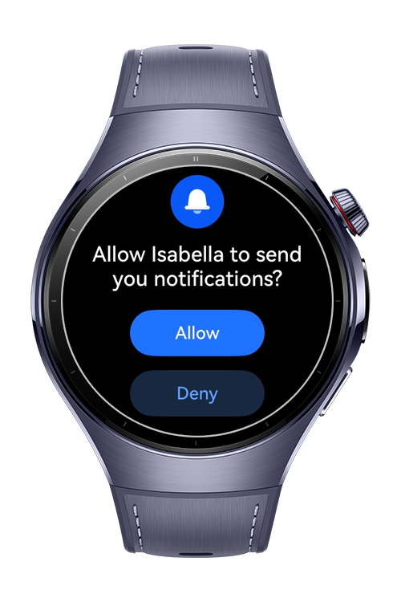
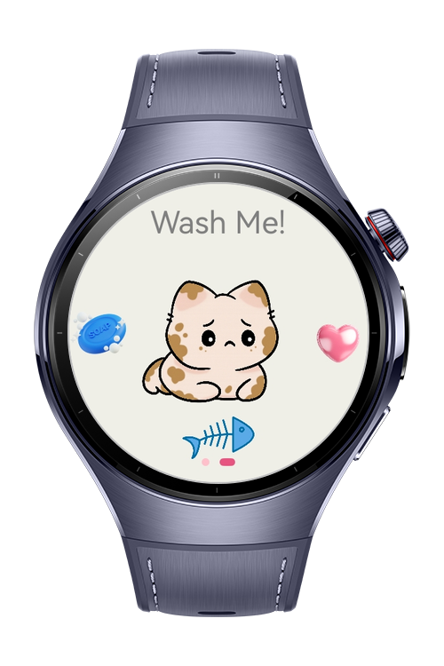
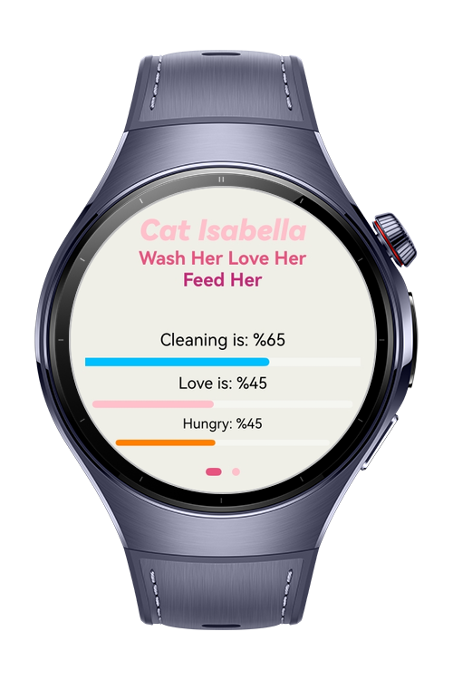
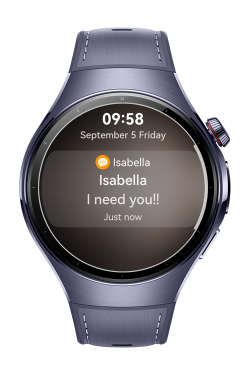

> **Note:** To access all shared projects, get information about environment setup, and view other guides, please visit [Explore-In-HMOS-Wearable Index](https://github.com/Explore-In-HMOS-Wearable/hmos-index).

# GrowYourPet

This is a basic game that you can play with your Huawei watch. Isabella is a lovely cat who needs you to wash, feed and
love her. When you forgot to do such things, she sends you reminders to make her remember. She vibrates your arm to take
care of her.

# Preview

<p align="left">
  
  
  
  
</p>

# Use Cases

- User can check Isabella's all status from status page
- User can feed, wash and love Isabella from Cat page
- All values are reducing in a timely manner after all of them is completed and user can see notifications from Isabella

# Tech Stack

- **Languages**: ArkTS, ArkUI
- **Frameworks**: HarmonyOS SDK 5.1.0(18)
- **Tools**: DevEco Studio Vers 5.1.0.842
- **Libraries**: 
- `@kit.ArkUI`, 
- `@kit.NotificationKit`
- `@kit.BasicServicesKit`, 
- `@kit.PerformanceAnalysisKit`, 
- `@kit.AbilityKit`,
- `@kit.BackgroundTasksKit`,
- `@kit.SensorServiceKit`

# Directory Structure

```
entry/src/main/ets/
|---pages
|   |---CatPage.ets   
|   |---Index.ets   
|   |---StatusPage.ets                
|---components      
|   |---Cat.ets  
|   |---CustomCatButton.ets                          
                       
|---entryability                   
|---entrybackupability   
|---PermissionUtils.ets 
```

# Constraints and Restrictions
## Supported Devices

- Huawei Watch 5

## Required Permissions

- "ohos.permission.KEEP_BACKGROUND_RUNNING",
- "ohos.permission.INTERNET",
- "ohos.permission.VIBRATE",
- "ohos.permission.PUBLISH_AGENT_REMINDER",

# LICENSE

Grow Your Pet is distributed under the terms of the MIT License.
See the [license](/LICENSE) for more information.